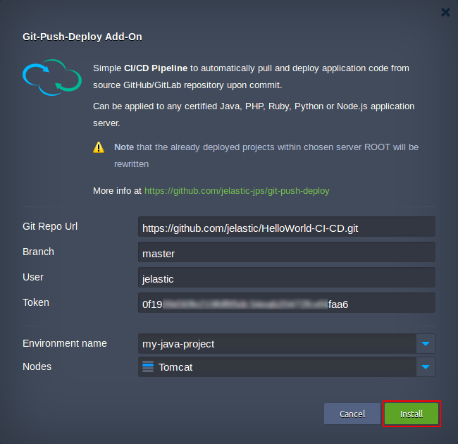

## Simple Automated CI/CD Pipeline for Git Projects

This Git-Push-Deploy solution enables automatic delivery of updates within your Git application sources directly to the cloud. The package can be applied as an add-on to **Java**, **PHP**, **Ruby**, **Node.js**, **Python** and **Go** projects, run on top of [the certified stack templates](https://docs.jelastic.com/software-stacks-versions#app-servers).


The workflow depends on the programming language used in your project:
- *for Java-based projects*, the package initiates creation of separate environment with a [Maven build node](https://docs.jelastic.com/maven-cloud-hosting-in-jelastic), which will be responsible for interaction with remote Git repository, triggering your application builds and their deployment to application server

- *for PHP/Ruby/Node.js/Python/Go apps*, the package sets up a pipeline for project deployment directly to the ROOT context on a web server (consider that Ruby app servers are displayed with a deployment mode instead of a context within dashboard, though the actual project location is the same) 


All related deployment operations are performed via [Jelastic API](https://docs.jelastic.com/api/). Herewith, if a server runs multiple containers, all of them will be restarted [sequentially](https://docs.jelastic.com/release-notes-49#sequential-restart-deploy) (with a 30-second delay by default) during the update to eliminate possible application downtime. Beside that, a special [ZDT Deployment](https://docs.jelastic.com/php-zero-downtime-deploy) option is used for PHP applications, ensuring their constant availability even with a single application server node.

## Requirements

Before applying the package, please consider the following points:

- The solution is proven for use with GitHub and GitLab repositories
- For a proper package installation, some preliminary Git repository configurations are required: 
  - generated and remembered *Personal Access Token* that corresponds to your [GitHub](https://github.com/jelastic-jps/git-push-deploy/wiki/GitHub-Access-Token) or [GitLab](https://github.com/jelastic-jps/git-push-deploy/wiki/GitLab-Access-Token) account
  - for integration with *Java-powered* app, the appropriate repository root should contain a **_pom.xml_** file with the following content as an obligatory basis (where *groupId*, *artifactId* and *version* values are optional):

```xml
<project>
    <modelVersion>4.0.0</modelVersion>
    <groupId>com.mycompany.app</groupId>
    <artifactId>my-app</artifactId>
    <version>1.0</version>
    <packaging>war</packaging>
    <build>
        <finalName>${project.artifactId}</finalName>
    </build>
</project>
```

[](https://jelastic.com/install-application/?manifest=https://raw.githubusercontent.com/jelastic-jps/java-memory-agent/master/manifest.jps)

## How to Integrate Git-Push-Deploy Pipeline to Jelastic Environment  

To install the Git-Push-Deploy package, copy link to the **_manifest.jps_** file above and [import](https://docs.jelastic.com/environment-import) it to your Jelastic dashboard.



Within the opened installation window, specify the following data:
- **_Git Repo Url_** - HTTPS link to your application repo
- **_Branch_** - a project branch to be used
- **_User_** - your Git account login
- **_Token_** - personal Git access token for webhook generation (can be created within [GitHub](https://github.com/jelastic-jps/git-push-deploy/wiki/GitHub-Access-Token)/[GitLab](https://github.com/jelastic-jps/git-push-deploy/wiki/GitLab-Access-Token) account settings) 
- **_Environment name_** - target environment your application should be deployed to
- **_Nodes_** - application server name (is fetched automatically upon selecting the environment)

Click **Install** and wait for Jelastic to configure CI/CD pipeline for your project. Once your application is deployed, all the further changes, committed to a source repository, will be automatically delivered to your environment inside Jelastic Cloud.

For more information on Git-Push-Deploy package use, refer to the corresponding [article](http://blog.jelastic.com/2017/04/20/git-push-deploy-to-containers/). 
